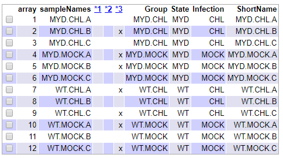
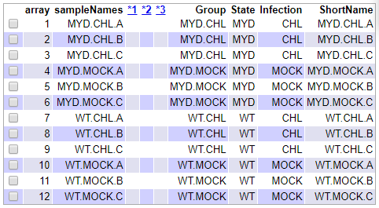

```{r setup, include=FALSE}
knitr::opts_chunk$set(echo = TRUE)
knitr::opts_chunk$set(fig.width=5, fig.height = 4, message=FALSE, warning=FALSE, knitr.table.format = 'markdown')
```
\clearpage
# Abstract

Para investigar la influencia del gen MyD88 en la respuesta inmune, ratones MyD88-/- y wild type son infectados con la bacteria *Chlamydia pneumoniae* y se analizan sus transcriptomas pulmonares. Estos datos se reanalizan bioinformáticamente en este estudio, con el uso de R y Bioconductor. Como resultado se obtiene una lista de genes diferencialmente expresados y un conjunto de vías moleculares que se ven afectadas. 

# Objetivos

Con este estudio se pretende investigar la influencia del gen MyD88 en la inducción de la resupuesta inmune en ratones, ilustrando detallademente el proceso de análisis bioinformático de microarrays. Para ello se reanalizan datos públicos procedentes de otra investigación, en busca de genes diferencialmente expresados. 

# Materiales y métodos

Este análisis se realiza a partir de los datos publicados por Rodríguez et al. el año 2007 (1). El dataset se encuentra publicado en la base de datos Gene Expression Omnibus (GEO) con el número de acceso GSE6688 (2).

Los datos se generaron con el objetivo de estudiar la influencia del gen MyD88 en la inducción de la resupuesta inmune. Para ello, se infectan ratones con la bacteria *Chlamydia pneumoniae*, la cual provoca pneumonia en humanos y ratones. 

En la investigación se realizan 3 experimentos independientes (A, B y C), en los cuales se realiza el mismo procedimiento. Se analiza la expresión génica de muestras de pulmón de ratones con el gen MyD88 desactivado (knock out (MYD)) o no (wild type (WT)), tres días después de ser (CHL) o no ser infectados (MOCK) con la bacteria. Es decir, se utiliza un diseño experimental 2x2, donde el ratón puede ser knock out o wild type y además puede ser infectado o no infectado por la bacteria. 

El microarray utilizado para la investigación es Affymetrix Mouse Expression 430A Array. 

En el siguiente enlace se encuentra el repositorio github que contiene todos los datos utilizados para este análisis, el código generado y los resultados obtenidos: https://github.com/olrema/Analisis_microarray. 

## Pipeline

A continuación se explica brevemente el procedimiento que se ha llevado a cabo para el análisis de microarray, utilizando como programa principal R y Bioconductor. 

Una vez obtenidos los datos en forma de archivos .CEL y creado el archivo *targets*, se procede a realizar el **primer control de calidad**, utilizando el paquete ArrayQualityMetrics. 

Seguidamente se procede a **normalizar** los datos para reducir la variabilidad de las muestras agena a razones biológicas y se realiza un **segundo control de calidad**.

A continuación se realiza el **filtraje no específico**, utilizando la función nsFilter y un punto de corte de 0,75. El paquete de anotaciones utilizado para realizar el filtraje y el resto del análisis es: mouse4302.db (3).

Para **seleccionar los genes diferencialmente expresados** se utiliza el método lineal del paquete limma. La **matriz de contrastes** creada para llevarlo a cabo, consta de las siguientes comparaciones: 

- MYDvsWT.CHL: ratones infectados knock out para el gen MyD88 vs ratones infectados wild type. 

- MYDvsWT.MOCK: ratones no infectados knock out para el gen vs ratones no infectados wild type.

- INT: ratones infectados vs no infectados. 

Con estas comparaciones lo que se pretende es evaluar el efecto de inactivar el gen MyD88 según si hay infección o no, y determinar si hay interacción entre la inactivación del gen y la infección. 

Una vez definida la matriz de contrastes, se estima el modelo y se obtiene la lista de genes diferencialmente expresados, utilizando el paquete limma.  

Se procede con la **anotación** de los genes para poder identificarlos, especificando el paquete comentado anteriormente. 

Para continuar, se realiza una **comparación múltiple** para evaluar cuantos genes se han seleccionado en cada comparación, utilizando la función decideTests, con parámetros p.value=0.1 y lfc=1.

Por último se lleva a cabo el **análisis de significación biológica** para ver qué vías moleculares aparecen más frecuentemente en la lista de genes seleccionados. Para ello se utiliza el paquete clusterProfiler, filtrando por el pvalor ajustado < 0.1 y la función rWikiPathways para descargar el archivo gmt con las vías moleculares. 

# Resultados  

En este apartado se muestran los resultados obtenidos en el estudio. Con el fin de obtener una idea de la distribución de los datos utilizados en el análisis se realizan varios gráficos. 

El primer gráfico representado en la **figura 1** muestra la densidad de las 12 muestras. El gráfico de la **figura 2** muestra una posible división de las muestras en grupos.

```{r, include = FALSE, eval=F}
#Creación de ficheros 
dir.create("data")
dir.create("results")
```

```{r, include = FALSE}
#Preparación de los datos
library(oligo)
celFiles <- list.celfiles("./data", full.names=TRUE)

library(Biobase)
targets <- read.AnnotatedDataFrame(file.path("./data","targets.csv"),header=TRUE, row.names = 1, sep = ";")

rawData <- read.celfiles (celFiles, phenoData=targets)

colnames(rawData)<-targets@data$ShortName
```

```{r DENS, echo=FALSE, fig.cap="Gráfico de densidad para las 12 muestras del estudio."}
#Visualización de los datos
#Gráfico de densidad
hist(rawData, main = "Gráfico de densidad", ylab= "Densidad", xlab="log-densidad", cex.main=0.75, cex.lab=0.6, cex.axis=0.7)
```

```{r DENDO, echo=FALSE, fig.cap="Dendrograma que representa el clúster jerárquico de las muestras, basado en la información de todos los genes."}
#Dendrograma
distmeth <- c("euclidian")
distan<-dist(t(exprs(rawData)), method=distmeth)
treemeth <- c("average")
hc <- hclust(distan,treemeth)
plot (hc, hang=-1, main="Dendrograma jerárquico", ylab="Distancia", xlab="Muestras",cex.main=0.75, cex.lab=0.6, cex.axis=0.7, cex=0.6)
```

## Control de calidad de los datos crudos

```{r control_crudo, include = FALSE, eval=F}
library (arrayQualityMetrics)
arrayQualityMetrics(rawData, outdir=file.path("./results", "QCDir.Raw"), force=TRUE)
```

A continuación se muestran los resultados obtenidos del primer control de calidad realizado sobre los datos crudos. En la **Figura 3** se representa un resumen de estos resultados. Como se puede observar, algunas de las muestras aparecen marcadas como problemáticas en el criterio utilizado número 3. Como solo aparecen marcadas en uno de los criterios, se decide que permanezcan en el análisis. 

{width=60%}

En la **figura 4** se puede observar también la distribución de intensidades de las muestras antes de normalizarlas en forma de diagrama de cajas. Cada color representa un tipo de muestra.

```{r CAJAS, echo=FALSE, fig.cap="Distribución de intensidades de los datos crudos."}
# boxplot
boxplot(rawData, las=2, col = c(rep("lightsalmon3", 3), rep("orchid3", 3), rep("orange3", 3), rep("skyblue3", 3)), main="Diagrama de cajas: datos crudos", adj=0.5, cex.main=0.75, cex.lab=0.6, cex.axis=0.7)
```

```{r NORM, include=FALSE}
# NORMALIZACIÓN DE LOS DATOS
eset_rma <- rma (rawData)
```

## Control de calidad de los datos normalizados

```{r control_norm, include=F, eval=F}
library (arrayQualityMetrics)
arrayQualityMetrics(eset_rma, outdir=file.path("./results", "QCDir.Norm"), force=TRUE)
```

Los siguientes resultados muestran el mismo control de calidad realizado anteriormente, ahora con los datos normalizados. Tanto en la **figura 5** como en la **figura 6** se observa una mejora clara de la calidad de los datos. Esto indica que la normalización se ha realizado adecuadamente y los datos estan preparados para ser filtrados.

{width=60%}

```{r CAJAS2, echo=FALSE, fig.cap="Distribución de intensidades de los datos normalizdos"}
# boxplot
boxplot(eset_rma, las=2, col = c(rep("lightsalmon3", 3), rep("orchid3", 3), rep("orange3", 3), rep("skyblue3", 3)), main="Diagrama de cajas: datos normalizados", adj=0.5, cex.main=0.75, cex.lab=0.6, cex.axis=0.7)
```

## Filtraje no específico

A continuación aparece el informe de los resultados del filtraje realizado.

```{r filtraje, echo=F}
library (genefilter)
library (mouse4302.db)
annotation (eset_rma) <- 'mouse4302.db'
filtered <- nsFilter (eset_rma, require.entrez = TRUE, remove.dupEntrez = TRUE, var.filter = TRUE, var.func = IQR, var.cutoff=0.75,filterByQuantile = TRUE, feature.exclude = "^AFFX")

filtered$filter.log
eset_filtered <-filtered$eset
```

```{r resultado_filtraje, include=FALSE, eval=F}
# Num genes antes del filtraje
eset_rma
# Num genes despues del filtraje
eset_filtered
```

Como resultado, queda un total de 3248 genes para analizar.

```{r guardado, include=FALSE, eval=F}
# Guardado de los datos obtenidos hasta ahora.
write.csv(exprs(eset_rma), file="./results/normalized.Data.csv")
write.csv(exprs(eset_filtered), file="./results/normalized.Filtered.Data.csv")
save(eset_rma, eset_filtered, file="./results/normalized.Data.Rda")
```

## Identificación de genes diferencialmente expresados

Las siguientes tablas muestran parte del listado de genes expresados diferencialmente en cada comparación realizada. En concreto se muestran los genes con el menor p-valor y por tanto, con una expresión diferencial mayor.

Para cada gen se muestra la siguiente información: 

- LogFC: diferencia media entre los grupos. 

- AveExpr: expresión promedio de los genes 

- t: estadístico t

- P.Value: prueba valor p. 

- adj.P.Val: valor p ajustado.

- B: prueba estadística B.

```{r matriz, include=F}
library(limma)
if (!exists("eset_filtered")) load (file="./results/normalized.Data.Rda")
designMat<- model.matrix(~0+Group, pData(eset_filtered))
colnames(designMat) <- c("MYD.CHL", "MYD.MOCK", "WT.CHL", "WT.MOCK")
designMat
```
```{r comparaciones, include=F}
cont.matrix <- makeContrasts (MYDvsWT.CHL = MYD.CHL-WT.CHL,
                              MYDvsWT.MOCK = MYD.MOCK-WT.MOCK, 
                              INT = (MYD.CHL-WT.CHL) - (MYD.MOCK-WT.MOCK),             
                              levels=designMat)
cont.matrix
```

```{r selección, include=F}
library(limma)
fit<-lmFit(eset_filtered, designMat)
fit.main<-contrasts.fit(fit, cont.matrix)
fit.main<-eBayes(fit.main)
```

```{r lista, echo=F}
tab_MYDvsWT.CHL <- topTable (fit.main, number=nrow(fit.main), coef="MYDvsWT.CHL", adjust='fdr')
knitr::kable(head(tab_MYDvsWT.CHL),caption="Genes que cambian su expresión en ratones infectados según si son knock out para el gen MyD88 o no.", booktabs=TRUE, align='c')

tab_MYDvsWT.MOCK <- topTable (fit.main, number=nrow(fit.main), coef="MYDvsWT.MOCK", adjust='fdr')
knitr::kable(head(tab_MYDvsWT.MOCK),caption="Genes que cambian su expresión en ratones no infectados según si son knock out para el gen MyD88 o no.", booktabs=TRUE, align='c')

tab_INT <- topTable (fit.main, number=nrow(fit.main), coef="INT", adjust='fdr')
knitr::kable(head(tab_INT),caption="Genes que cambian su expresión según si los ratones están infectados o no", booktabs=TRUE, align='c')
```

Los resultados obtenidos en las tablas anteriores se aprecian de forma más visual en las gráficas siguientes (**figura 7, 8, 9**). Estas gráficas contienen resaltados los símbolos de los genes candidatos a tener una expresión diferencial en cada una de las tres comparaciones. 

```{r volcano_1, echo=F, fig.cap="Volcanoplot que muestra 2 de los genes diferencialmente expresados en ratones infectados según si son knock out o wild type."}
geneSymbols <- select(mouse4302.db, rownames(fit.main), c("SYMBOL"))
SYMBOLS<- geneSymbols$SYMBOL
volcanoplot(fit.main, coef="MYDvsWT.CHL", highlight=2, names=SYMBOLS, 
             main=paste("Genes expresados diferencialmente", colnames(cont.matrix)[1], sep="\n"), pch='.',adj=0.5, cex.main=0.75, cex.lab=0.6, cex.axis=0.7)
abline(v=c(-1,1))

```

```{r volcano_2, echo=F, fig.cap="Volcanoplot que muestra 7 de los genes diferencialmente expresados en ratones no infectados según si son knock out para el gen MyD88 o no."}
volcanoplot(fit.main, coef="MYDvsWT.MOCK", highlight=7, names=SYMBOLS, 
             main=paste("Genes expresados diferencialmente", colnames(cont.matrix)[2], sep="\n"),pch='.',adj=0.5, cex.main=0.75, cex.lab=0.6, cex.axis=0.7)
abline(v=c(-1,1))
```

```{r volcano_3, echo=F,fig.cap="Volcanoplot que muestra 5 de los genes diferencialmente expresados en la comparación entre ratones infectados y no infectados."}

volcanoplot(fit.main, coef="INT", highlight=5, names=SYMBOLS, 
             main=paste("Genes expresados diferencialmente", colnames(cont.matrix)[3], sep="\n"),pch='.',adj=0.5, cex.main=0.75, cex.lab=0.6, cex.axis=0.7)
abline(v=c(-1,1))
```

## Anotación de los resultados

Las **tablas 4, 5 y 6** contienen la anotación de algunos de los genes seleccionados anteriormente. Si se desea obtener más información, en los archivos de resultados adjuntos se encuentra la anotación completa de cada comparación realizada, con una columna adicional que contiene el nombre completo y la descripción de cada gen (*topAnnotated_*comparación). 

```{r funcion_anotacion, include=F}

# Función ya creada para hacer la anotación
annotatedTopTable <- function(topTab, anotPackage)
{topTab <- cbind(PROBEID=rownames(topTab), topTab)
myProbes <- rownames(topTab)
thePackage <- eval(parse(text = anotPackage))
geneAnots <- select(thePackage, myProbes, c("SYMBOL", "GENENAME", "ENTREZID"))
annotatedTopTab<- merge(x=geneAnots, y=topTab, by.x="PROBEID", by.y="PROBEID")
return(annotatedTopTab)
}
```

```{r anotacion,, echo=F}
topAnnotated_MYDvsWT.CHL <- annotatedTopTable(tab_MYDvsWT.CHL,
anotPackage="mouse4302.db")
topAnnotated_MYDvsWT.MOCK <- annotatedTopTable(tab_MYDvsWT.MOCK,
anotPackage="mouse4302.db")
topAnnotated_INT <- annotatedTopTable(tab_INT, anotPackage="mouse4302.db")

knitr::kable(head(topAnnotated_MYDvsWT.CHL[,-(3:4)]),caption="Anotación de los genes que cambian su expresión en ratones infectados.", booktabs=TRUE, align='c')

knitr::kable(head(topAnnotated_MYDvsWT.MOCK[,-(3:4)]),caption="Anotación de los genes que cambian su expresión en ratones no infectados.", booktabs=TRUE, align='c')

knitr::kable(head(topAnnotated_INT[,-(3:4)]),caption="Anotación de los genes que cambian su expresión según si los ratones están infectados o no.", booktabs=TRUE, align='c')

```

```{r guardado_anotaciones, eval=F, include=F}
write.csv(topAnnotated_MYDvsWT.CHL, file="./results/topAnnotated_MYDvsWT.CHL.csv")
write.csv(topAnnotated_MYDvsWT.MOCK, file="./results/topAnnotated_MYDvsWT.MOCK.csv")
write.csv(topAnnotated_INT, file="./results/topAnnotated_INT.csv")
```

## Comparación múltiple

Los resultados obtenidos de la comparación múltiple se resumen en la **tabla 7**, la cual se encuentra representada gráficamente en la **figura 10**. 

"Down" hace referencia a los genes que se han visto *down* regulados, "NotSig" a los que no tienen una expresion diferencial significaiva y, por último, "Up" hace referencia a aquellos genes que se han visto sobreexpresados. 

Estos resultados muestran que la mayor parte de genes diferencialmente expresados encontrados en el estudio, forman parte del grupo infectado de ratones. Así mismo, los ratones que no han sido infectados presentan únicamente dos genes expresados diferencialmente. 

```{r comp_mult, echo=F}

res<-decideTests(fit.main, method="separate", adjust.method="fdr", p.value=0.1, lfc=1)

sum.res.rows<-apply(abs(res),1,sum)
res.selected<-res[sum.res.rows!=0,]

knitr::kable(summary(res),caption="Resumen de la comparación múltiple.", booktabs=TRUE, align='c')
```

```{r venn, echo=F,fig.cap="Diagrama de venn mostrando los genes diferencialmente expresados en común entre las 3 comparaciones realizadas."}

vennDiagram (res.selected[,1:3], cex=0.65,adj=0.5, cex.main=0.75, main="Genes en común entre las 3 comparaciones")
```

```{r, echo=F}
probeNames <- rownames(res.selected)
HMdata <- exprs(eset_filtered)[rownames(exprs(eset_filtered)) %in% probeNames,]
 
geneSymbols <- select(mouse4302.db, rownames(HMdata), c("SYMBOL"))
rownames(HMdata) <- geneSymbols$SYMBOL
```
```{r guardado_heatmap,echo=F,eval=F}
write.csv(HMdata, file = file.path("./results/data4Heatmap.csv"))
```

```{r heatmap, echo=F, fig.cap='Heatmap para los genes seleccionados como diferencialmente expresados en alguna de las tres comparaciones, agrupados por muestras.'}
colorMap<- colorRampPalette(c("green", "red"))(n = 299)
library(gplots)
par(cex.main=0.75, cex=0.75)
heatmap.2(HMdata,
           Rowv = FALSE,
           main = "Genes diferencialmente expresados.",
           scale = "row",
           col = colorMap,
           cexRow = 0.5,
           cexCol = 0.9,
           key = TRUE,
           keysize = 2,
           density.info = "none",
           ColSideColors = c(rep("lightsalmon3",3),rep("orchid3",3), rep("orange3",3), rep("skyblue3",3)),
           tracecol = NULL,
           srtCol = 30)
```

La **figura 11** refleja en forma de heatmap los genes que se han seleccionado como diferencialmente expresados anteriormente. 

## Análisis de significación biológica

La **tabla 8** resume el número de genes de cada comparación que se van a tener en cuenta para realizar el análisis de significación biológica. Tal y como se observa, la única comparación que tiene una cantidad de genes óptimos para ser incluida en el análisis es la primera, correspondiente a la comparación entre ratones infectados knock out para el gen MYD y ratones infectados wild type.

```{r listado_genes, echo=F}
# Listado de tablas
tableslist <- list(MYDvsWT.CHL = tab_MYDvsWT.CHL, 
                     MYDvsWT.MOCK  = tab_MYDvsWT.MOCK, 
                     INT = tab_INT)
newlist <- list()
for (i in 1:length(tableslist)){
   topTab <- tableslist[[i]]
   # Selección de genes incluidos
   genes<-topTab["adj.P.Val"]<0.1
   selectedIDs <- rownames(topTab)[genes]
   # Pasamos de ID a ENTREZ
   entrezIDs<- select(mouse4302.db, selectedIDs, c("ENTREZID"))
   entrezIDs <- entrezIDs$ENTREZID
   newlist[[i]] <- entrezIDs
   names(newlist)[i] <- names(tableslist)[i]
 }
numOfGenes<- sapply(newlist, length)
knitr::kable(numOfGenes,caption="Número de genes a estudiar en cada comparación.", booktabs=TRUE, align='c')
```

Como resultado del análisis de significación se obtiene la **tabla 9** (que aparece completa en los archivos adjuntos como *clusterProfiler.Results.MYDvsWT.CHL*) y la **figura 12 **, que resume la red de las diferentes vías encontradas en el análisis. Son un total de 11 vías encontradas en la comparación mencionada, entre las cuales destaca la via de señalización de la quimiocina. 

```{r enrich1, echo=F}
library(magrittr)
library(clusterProfiler)
genelist <- topAnnotated_MYDvsWT.CHL[,9]
names (genelist)<- as.character(topAnnotated_MYDvsWT.CHL[,4])
genelist <- sort (genelist, decreasing = T)
gene <- names(genelist)[abs(genelist)<0.1]

wpgmtfile<-rWikiPathways::downloadPathwayArchive(organism="Mus musculus", format = "gmt")
wp2gene <- read.gmt(wpgmtfile)

wp2gene <- wp2gene %>% tidyr::separate(ont, c("name","version","wpid","org"), "%")
wpid2gene <- wp2gene %>% dplyr::select(wpid, gene)
wpid2name <- wp2gene %>% dplyr::select(wpid, name)
ewp <- enricher(gene, TERM2GENE = wpid2gene, TERM2NAME = wpid2name)

knitr::kable(head(ewp[,-c(1,7:10)]),caption="Parte de los resultados del clusterProfiler para la comparación entre ratones knock outs y wild types infectados.", booktabs=TRUE, align='c')
```

```{r guardado_enrich1, echo=F, eval=F}
write.csv(as.data.frame(ewp),file =paste0("./results/","clusterProfiler.Results.MYDvsWT.CHL.csv"),row.names = FALSE)
```

```{r, echo=F, fig.cap="Red obtenida del análisis de significación biológica para la comparación KO y WT en ratones infectados."}
emapplot(ewp)
```

# Discusión

Comparando los resultados obtenidos con el estudio original se aprecian algunas diferencias. La principal diferencia es el número de genes diferencialmente expresados que se encuentran. En el estudio original se encuentran  378 genes, mientras que en este caso se encuentran 3121. Este aspecto podría mejorarse, afinando más los filtrajes, así como el valor de lfc o fdr. 

Otra diferencia remarcable es que la mayoría de genes seleccionados se encuentran upregulados en el estudio original, mientras que en este análisis la mayoría son downregulados. Esto puede deberse a que las matrices de contrastes realizadas en cada caso sean diferentes. Dependiendo de como se hagan las comparaciones, puedes obtener un resultado u otro, significando lo mismo biológicamente.

Finalmente, si observamos los heatmaps obtenidos, son muy similares. En ambos casos la mayoría de genes diferencialmente expresados se situan en el grupo de ratones infectados. 

Una de las limitaciones encontradas a la hora de realizar el análisis ha sido el paquete de anotaciones. Al inicio del análisis se pretendría utilizar el paquete Affymoe4302Expr (4), pero no era posible cargarlo en el programa, así que se decidió cambiarlo. 

# Conclusión

Como conclusión final podemos extraer que el gen MyD88 es clave para la respuesta inmune, puesto que en ratones infectados que lo contienen, la expresión de otros genes secundarios se ve afectada. En cambio, en ratones infectados que no tienen el gen, el número de genes expresados diferencialmente disminuye mucho. 

Por último, el análisis de pathways indica claramente que la mayoría de genes que se han visto expresados diferencialmente están involucrados en la vía de señalización de las quimiocinas, la cual es crucial en las respuestas inflamatorias y el control de tráfico de leucocitos (5).  

En resumen, este análisis nos permite comprobar que realmente el gen MyD88 es importante para activar la respuesta inmune en ratones ya que su ausencia provoca que, no inicien la respuesta inmune contra la bacteria con la que han sido infectados. 

# Bibliografía

(1) Rodríguez, N., Mages, J., Dietrich, H., Wantia, N., Wagner, H., Lang, R., & Miethke, T. (2007). MyD88-dependent changes in the pulmonary transcriptome after infection with Chlamydia pneumoniae. Physiological Genomics, 30(2), 134–145.doi:10.1152/physiolgenomics.00011.2007 

(2) GEO Accession viewer (2020). https://www.ncbi.nlm.nih.gov/geo/query/acc.cgi?acc=GSE6688

(3) GEO Accession viewer (2020). http://bioconductor.org/packages/release/data/annotation/html/mouse4302.db.html

(4) GEO Accession viewer (2020). http://bioconductor.org/packages/release/data/experiment/html/Affymoe4302Expr.html

(5) R&D Systems 2020. Chemokine Signaling Pathways.
https://www.rndsystems.com/pathways/chemokine-signaling-pathways